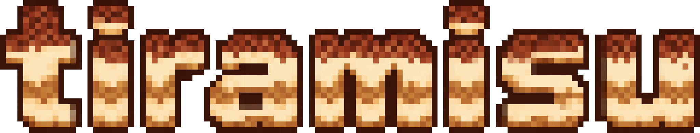

<p align="center">
  <picture>
    
  </picture>
</p>

<p align="center">
  <b>
    Git-native memory for AI coding agents.
  </b>
</p>

<div align="center">
  <picture>
    <source media="(prefers-color-scheme: dark)" srcset="docs/assets/cursor-white.svg">
    
  </picture>
  &nbsp;&nbsp;
  <picture>
    <source media="(prefers-color-scheme: dark)" srcset="docs/assets/claudecode-white.svg">
    
  </picture>
  &nbsp;&nbsp;
  <picture>
    <source media="(prefers-color-scheme: dark)" srcset="docs/assets/codex-white.svg">
    
  </picture>
  &nbsp;&nbsp;
  <picture>
    <source media="(prefers-color-scheme: dark)" srcset="docs/assets/opencode-white.svg">
    
  </picture>
  &nbsp;&nbsp;
  <picture>
    <source media="(prefers-color-scheme: dark)" srcset="docs/assets/antigravity-white.svg">
    
  </picture>
</div>

<div align="center">
  <a href="https://discord.gg/X4M5qynD88">
    
  </a>
  <a href="https://www.npmjs.com/package/tiramisu">
    
  </a>
  <a href="https://github.com/buildsip/tiramisu/blob/main/LICENSE">
    
  </a>
  
  <a href="https://www.bestpractices.dev/projects/14788">
    
  </a>
  <a href="https://scorecard.dev/viewer/?uri=github.com/buildsip/tiramisu">
    
  </a>
  <a href="https://github.com/buildsip/tiramisu/actions/workflows/ci.yml">
    
  </a>
</div>

Tiramisu helps your agent access **project, personal, team, and organization** memories at the same time.

> [!WARNING]
> 🚧 **Status:** Alpha. The architecture and CLI are actively evolving. 🚧

<p align="center">
  
</p>

# Quickstart

## Step 1: Configure pruning (Optional)

Upvotes and pruning reduce stale memories.

When a memory helps solve a task, it gets upvoted, which extends its lifespan. These events are stored in the database. On request, the agent can prune memories, meaning it reviews expired memories and suggests updates or deletions.

If you skip this step, upvotes are disabled, but the agent can still prune manually by searching your codebase to verify relevance.

### Option A: Self-Hosted

Spin up a PostgreSQL database.

> [!TIP]
> You can use the **same database** across all your organization's repositories. Try **[Neon](https://neon.tech)** or **[Supabase](https://supabase.com)** for free.

### Option B: tiramisu app (Coming Soon)

⚡ Cloud Database, 📊 Dashboard, 🤖 Automated Pruning PRs

## Step 2: Separate project memories from personal, team, and/or organization memories (Optional)

This step is useful for teams. Solo devs can skip to [Step 3](./README.md#step-3-installation).

1. Create one repo per set of memories you want to keep separate (e.g. per team, one company-wide, one personal).
2. Add each repo to your IDE **and** agent harness **workspaces** to "import" the memories.
3. Install `tiramisu` in each repo:

```bash
npx tiramisu init --availableToWorkspace
```

## Step 3: Install to project

Inside your **project**, run:

```bash
npx tiramisu init
```

This installs the CLI, the MCP tools, and configures your repo.

---

Report a [bug](https://github.com/buildsip/tiramisu/issues).
Send [feedback](https://github.com/buildsip/tiramisu/discussions).
[Join Discord](https://discord.gg/X4M5qynD88)