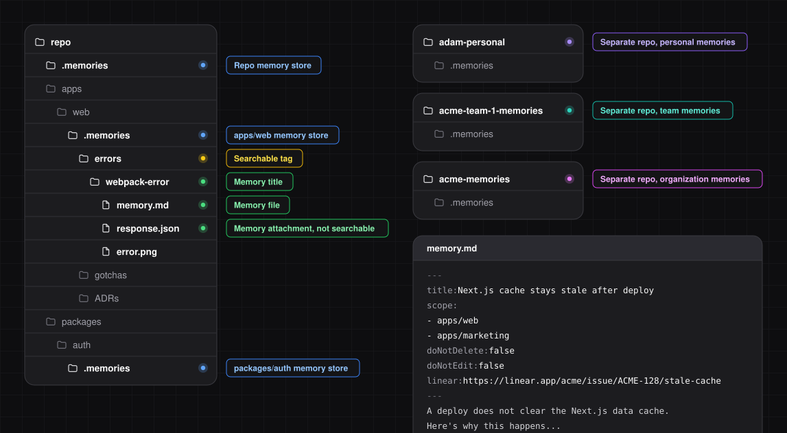

**Tiramisu is a git-native memory system for AI coding agents.** It stores curated memories as Markdown files inside your repositories.

Tiramisu is [open source](https://github.com/buildsip/tiramisu).



> [!TIP]
> Tiramisu works across multiple languages and agent harnesses. Check the [compatibility tables](./03-compatibility.md).

## Step 1: Configure pruning (Optional)

[Upvotes and pruning](./06-upvotes-and-pruning.md) reduce stale memories.

When a memory helps solve a task, it gets upvoted, which extends its lifespan. These events are stored in the [database](../02-api-reference/database.md). On request, the agent can prune memories, meaning it reviews expired memories and suggests updates or deletions.

If you skip this step, upvotes are disabled, but the agent can still prune manually by searching your codebase to verify relevance.

### Option A: Self-Hosted

Spin up a PostgreSQL database to store upvotes.

> [!TIP]
> You can use the **same database** across all your organization's repositories. Try **[Neon](https://neon.tech)** or **[Supabase](https://supabase.com)** for free.

### Option B: Tiramisu app (Coming Soon)

- ⚡ Cloud Database
- 📊 Dashboard
- 🤖 Automated Pruning PRs

## Step 2: Separate project memories from personal, team, and/or organization memories (Optional)

This step is useful for teams. Solo devs can skip to [Step 3](#step-3-install-to-project).

1. Create one repo per set of memories you want to keep separate (e.g. per team, one company-wide, one personal).
2. Add each repo to your IDE **and** agent harness **workspaces** to "import" the memories.
3. Install Tiramisu in **each repo**:

```bash package="npm"
npx tiramisu@latest init --availableToWorkspace
```

```bash package="pnpm"
pnpm dlx tiramisu@latest init --availableToWorkspace
```

```bash package="yarn"
yarn dlx tiramisu@latest init --availableToWorkspace
```

```bash package="bun"
bunx --bun tiramisu@latest init --availableToWorkspace
```

## Step 3: Install to project

Inside your **project(s)**, run:

```bash package="npm"
npx tiramisu@latest init
```

```bash package="pnpm"
pnpm dlx tiramisu@latest init
```

```bash package="yarn"
yarn dlx tiramisu@latest init
```

```bash package="bun"
bunx --bun tiramisu@latest init
```
